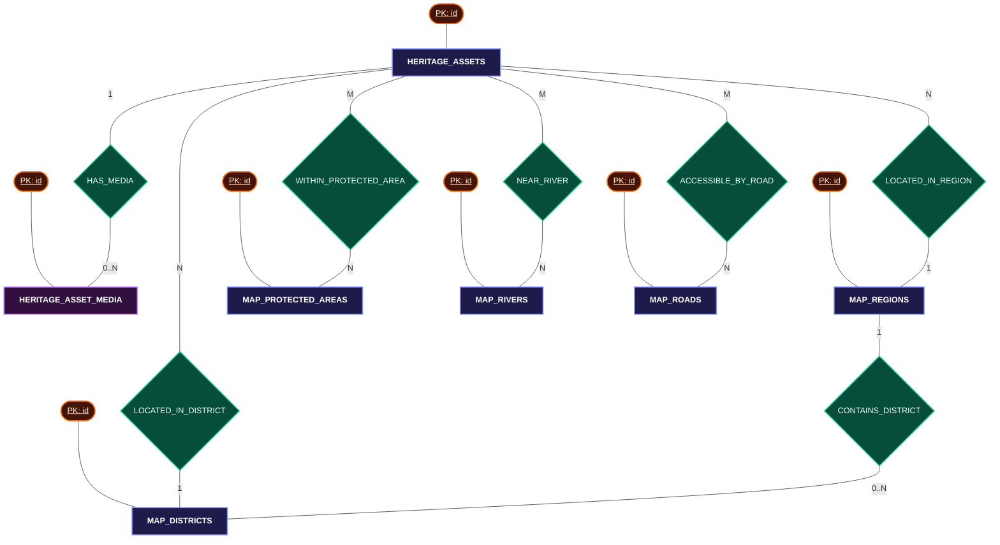
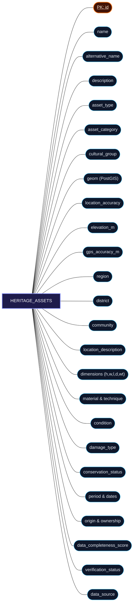
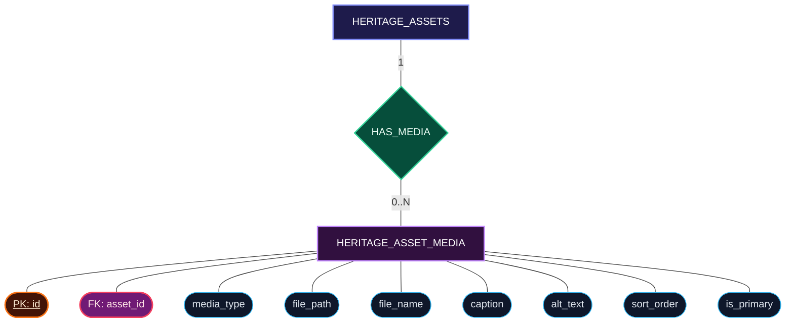

# Project Epoch — Database Entity Relationship Diagram (ERD)

This document contains the complete **Chen Entity Relationship Diagram (ERD)** for the **Project Epoch** database, provided in both **Interactive Mermaid Diagrams** and **Markdown Visual ASCII/Unicode Illustrations**.

---

## 🔑 ERD Symbol Legend (Chen Notation)

```
  +--------------------+         (                    )         /                    \
  |    ENTITY NAME     |         (   ATTRIBUTE NAME   )        /  RELATIONSHIP NAME   \
  |    (Rectangle)     |         (       (Oval)       )        \      (Diamond)       /
  +--------------------+         (                    )         \                    /
```
- **Rectangles `[ ]`**: Entity sets (database tables)
- **Ovals `( )`**: Attributes (table columns, metadata, geometry)
  - **<u>Double Line / Underlined</u>**: Primary Key (PK) attribute
  - **Dashed Oval**: Foreign Key (FK) or Derived attribute
- **Diamonds `{ }`**: Relationships connecting entities with cardinalities (`1:N`, `M:N`, `1:1`)

---

## 1. High-Level Entity-Relationship Connection Map (ASCII Illustration)

```
                                          ( name_en )        ( name )       ( geom )
                                               \                |              /
                                            +-------------------------------------+
                                            |             MAP_REGIONS             |
                                            +-------------------------------------+
                                               | (1)                           | (1)
                                               |                               |
                                      /-----------------\             /-----------------\
                                     / CONTAINS_DISTRICT \           / LOCATED_IN_REGION \
                                     \                   /           \                   /
                                      \-----------------/             \-----------------/
                                               | (N)                           | (N)
                                               v                               v
    ( label )   ( name )   ( geom )         +---------------+                  |
        \          |          /             | MAP_DISTRICTS |                  |
     +--------------------------+           +---------------+                  |
     |       MAP_DISTRICTS      |                  ^                           |
     +--------------------------+                  |                           |
                   ^                               | (1)                       |
                   |                      /-------------------\                |
                   +---------------------/ LOCATED_IN_DISTRICT \               |
                                         \                     /               |
                                          \-------------------/                |
                                                    ^                          |
                                                    | (N)                      |
   ( file_path ) ( media_type )                     |                          |
        \             /                             |                          |
    /---------------------\      (1)     +--------------------+                |
   /      HAS_MEDIA        \-------------|  HERITAGE_ASSETS   |<---------------+
   \                       /             +--------------------+
    \---------------------/                         |
               | (N)                                | (M)
               v                                    v
   +-----------------------+              /--------------------\
   | HERITAGE_ASSET_MEDIA  |             / WITHIN_PROTECTED_   \
   +-----------------------+            /        AREA           \
        |         |                      \                      /
     ( id )   ( asset_id )                \--------------------/
      (PK)       (FK)                               | (N)
                                                    v
                                         +---------------------+
                                         | MAP_PROTECTED_AREAS |
                                         +---------------------+
                                                    |
                                            ( name )  ( geom )
```

---

## 2. Complete Chen ERD — Full System Mermaid Diagram



---

## 3. Entity Detailed Chen Diagrams & Connections

### 3.1 Entity 1: `HERITAGE_ASSETS` (Main Entity)

```
                                  ( <u>id</u> [PK] )
                                         |
    ( asset_category ) ---------+        |        +--------- ( name )
    ( asset_type ) -------------|        |        | --------- ( alternative_name )
    ( cultural_group ) ---------|        |        | --------- ( description )
    ( condition ) --------------+--+-----+-----+--+--------- ( data_completeness_score )
    ( conservation_status ) -------|  HERITAGE |----------- ( geom [PostGIS Geometry] )
    ( verification_status ) -------|   ASSETS  |----------- ( elevation_m )
    ( data_source ) --------------+--+-----+-----+--+--------- ( gps_accuracy_m )
    ( location_accuracy ) ------|        |        | --------- ( region )
    ( material ) ---------------|        |        | --------- ( district )
    ( secondary_material ) -----|        |        | --------- ( community )
    ( technique ) --------------+        |        +--------- ( location_description )
                                         |
                       ( dimensions: height/width/length )
                       ( temporal: period/dates/age )
                       ( provenance: origin/ownership )
```



---

### 3.2 Entity 2: `HERITAGE_ASSET_MEDIA` (Weak Entity & `HAS_MEDIA` Relationship)

```
  +------------------+                    /-----------\                   +-----------------------+
  | HERITAGE_ASSETS  |-----( 1 )---------/  HAS_MEDIA  \-----( 0..N )---->| HERITAGE_ASSET_MEDIA  |
  +------------------+                   \-----------/                   +-----------------------+
                                               |                                     |
                                        ( Relationship )           +-----------------+-----------------+
                                                                   |                 |                 |
                                                            ( <u>id</u> [PK] )   ( asset_id [FK] )   ( media_type )
                                                                                     |                 |
                                                                              ( file_path )      ( file_name )
                                                                                     |                 |
                                                                              ( caption )        ( is_primary )
```



---

### 3.3 Spatial GIS Reference Entities & Relationships

```
                                      +--------------------+
                                      |    MAP_REGIONS     |
                                      +--------------------+
                                         |              |
                           ( <u>id</u>, name, geom )          | (1)
                                                        v
                                             /-------------------\
                                            / CONTAINS_DISTRICT   \
                                            \                     /
                                             \-------------------/
                                                        | (N)
                                                        v
                                      +--------------------+
                                      |   MAP_DISTRICTS    |
                                      +--------------------+
                                                |
                                     ( <u>id</u>, name, label, geom )

 -----------------------------------------------------------------------------------------

  +------------------+                   /-------------------------\                 +-----------------------+
  | HERITAGE_ASSETS  |-----( M )--------/ WITHIN_PROTECTED_AREA     \-----( N )----->| MAP_PROTECTED_AREAS   |
  +------------------+                  \                           /                +-----------------------+
            |                            \-------------------------/                             |
            |                                                                           ( <u>id</u>, name, geom )
            |                            /-------------------------\                 +-----------------------+
            +--------------( M )--------/        NEAR_RIVER         \-----( N )----->|      MAP_RIVERS       |
            |                           \                           /                +-----------------------+
            |                            \-------------------------/                             |
            |                                                                           ( <u>id</u>, name, geom )
            |                            /-------------------------\                 +-----------------------+
            +--------------( M )--------/    ACCESSIBLE_BY_ROAD     \-----( N )----->|       MAP_ROADS       |
                                        \                           /                +-----------------------+
                                         \-------------------------/                             |
                                                                                        ( <u>id</u>, name, geom )
```

---

## 4. Connection & Cardinality Matrix Table

| Source Entity `[Rectangle]` | Relationship `<Diamond>` | Target Entity `[Rectangle]` | Cardinality | Link Mechanism |
| :--- | :--- | :--- | :--- | :--- |
| `HERITAGE_ASSETS` | `{ HAS_MEDIA }` | `HERITAGE_ASSET_MEDIA` | `1 : 0..N` | `heritage_asset_media.asset_id = heritage_assets.id` (ON DELETE CASCADE) |
| `HERITAGE_ASSETS` | `{ LOCATED_IN_DISTRICT }` | `MAP_DISTRICTS` | `N : 1` | Spatial containment (`ST_Contains`) or `heritage_assets.district = map_districts.name` |
| `HERITAGE_ASSETS` | `{ LOCATED_IN_REGION }` | `MAP_REGIONS` | `N : 1` | Spatial containment (`ST_Contains`) or `heritage_assets.region = map_regions.name` |
| `HERITAGE_ASSETS` | `{ WITHIN_PROTECTED_AREA }` | `MAP_PROTECTED_AREAS` | `M : N` | PostGIS spatial intersection (`ST_Intersects(heritage_assets.geom, map_protected_areas.geom)`) |
| `HERITAGE_ASSETS` | `{ NEAR_RIVER }` | `MAP_RIVERS` | `M : N` | PostGIS spatial distance check (`ST_DWithin(heritage_assets.geom, map_rivers.geom, distance)`) |
| `HERITAGE_ASSETS` | `{ ACCESSIBLE_BY_ROAD }` | `MAP_ROADS` | `M : N` | PostGIS spatial distance check (`ST_DWithin(heritage_assets.geom, map_roads.geom, distance)`) |
| `MAP_REGIONS` | `{ CONTAINS_DISTRICT }` | `MAP_DISTRICTS` | `1 : 0..N` | PostGIS spatial containment (`ST_Contains(map_regions.geom, map_districts.geom)`) |
